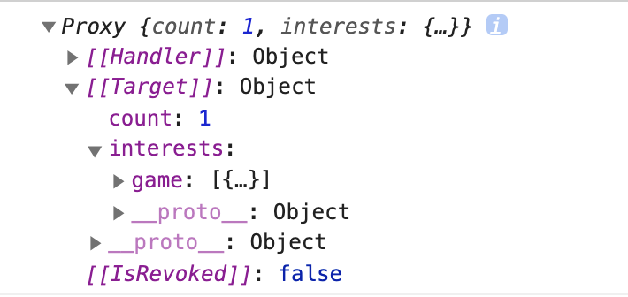

# reactive-in-vue-
Vue2中是用Object.defineProperty实现的响应式数据，代码见(myVue2.html)
现在如果使用Proxy完成数据的响应式处理，该如何去做呢？  

Vue3中就是使用了Proxy，但是看Vue的实现之前，肯定想自己先改造一下试试，然后再看Vue3.0的源码，这样可以看到自己的代码哪里垃圾。  

改造defineProperty版本的Vue成Proxy版本首先必须要很清楚地知道两者的区别：  

我自己的理解是：defineProperty这个api是针对Object上已经存在的某一个key做了一个拦截，使用这个api时你必须指定一个Object上存在的key，然后你就可以拦截这个key的get和set操作。当然，需要指定key就意味着你不可能拦截到Object上新增的属性，因为你不可能提前知道会新增的key是什么。  

而Proxy不是针对Object上面已存在的key的，Proxy是针对整个对象的，整个对象有get或set操作都可以拦截到，所以在这个api里也不用指定key。拦截整个对象，那么对象上新增属性那肯定是可以监听到了。  

一句话总结就是Object.defineProperty拦截key，Proxy拦截整个对象。  

首先说要做成什么样的：  

1.要能监听到深层级的set  

2.如果set的是一个Object/Array，那么它也要是响应式的  

先给出测试用例：  

```
let obj = {
    count: 0,
    name: 'chenbj',
}
obj = reactive(obj)
obj.interests = {
    game: [{
        name: '三国：全面战争',
        duration: '120h'
    }]
}
// 下面的操作要能监听到
obj.interests.game[0].name = '侠客风云传'
```

然后实现，其实也就是递归proxy，然后注意一下set的对象也要proxy就可以了（项目中的myProxyVue.html）：  
```
const isType = type => target => `[object ${type}]` === Object.prototype.toString.call(target)
function reactive(target) {
    const _proxy = target => {
        if(!isType('Object')(target) && !isType('Array')(target)) {
            return target
        }
        for(let item in target) {
            let currentTarget = target[item]
            if(isType('Object')(currentTarget) || isType('Array')(currentTarget)) {
                target[item] = _proxy(currentTarget)
            }
        }
        return new Proxy(target, {
            get(target, key) {
                return Reflect.get(target, key)
            },
            set(target, key, value) {
                console.log('检测到数据变化')
                return Reflect.set(target, key, _proxy(value))
            }
        })
    }
    return _proxy(target)
}
let obj = {
    count: 0,
    name: 'chenbj',
}
obj = reactive(obj)
obj.interests = {
    game: [{
        name: '三国：全面战争',
        duration: '120h'
    }]
}
obj.interests.game[0].name = '侠客风云传'
```
下面根据Vue3的源码看看自己的实现哪里垃圾。
我不想省略调试源码的步骤，首先要npm i  vue-next，然后找到node_modules/vue-next/packages/vue/dist/vue.global.js，这个就可以作为我们要调试的源码，直接copy出来到根目录在script标签中引入即可，下面是一个完整的例子(项目中vue3.html)：
 ```
 <!DOCTYPE html>
<html lang="en">
<head>
  <meta charset="UTF-8">
  <meta name="viewport" content="width=device-width, initial-scale=1.0">
  <meta http-equiv="X-UA-Compatible" content="ie=edge">
  <title>Document</title>
  <script src="./vue.global.js"></script>
</head>
<body>
  <div id="app"></div>
  <script>
    const { reactive, computed, effect, watch, createApp } = Vue
    const App = {
      template: `
        <div id="box">
            <button @click="increment">{{ state.interests.game[0].name }}</button>
        </div> 
      `,
      setup() {
        const state = reactive({
          count: 0,
          interests: {
            game: [{
                name: '三国：全面战争',
                duration: '120h'
            }]
          }
        })
        function increment(e) {
          state.interests.game[0].name = '侠客风云传'
        }
        effect(() => {
          console.log(state, state.interests.game[0].name)
        })
        return {
          state,
          increment
        }
      }
    }
    createApp().mount(App, '#app')
  </script>
</body>
</html>
 ``` 
在effect中输出state看到的结果如下图：  

  

这个令人疑惑的点是：为什么interest不是一个Proxy，但是点击设置interest下的数据的时候还能在模版上响应？  

本来想在源码中看看为什么，但是没太看懂，所以还是故技重施想在github上找个vue3-lite之类的东西看看，就找到了这个项目：https://github.com/shengxinjing/kkb-vue3，在这里看响应式原理部分就很容易看懂了。  

如果你输出state.interest，state.interest.game或者state.interest.game[0]，你会发现他们其实也是Proxy。但为什么输出state时不是Proxy呢，因为其实输出state的时候，你并没有get或set其下的数据，所以它也没有必要是一个Proxy，只有访问了一个对象的时候它才有必要是Proxy的。  

反观我们之前自己实现的代码，执行obj = reactive(obj)之后，整个树上的所有Array/Object都会变成响应式的，完成整个递归是需要时间的，这段时间内已经完成响应式的数据也需要等待全部遍历才能响应，这不合理，如果能用到的时候再变成响应式，就会更好一些，我们不用一开始就完成整个树的响应式处理。  

所谓用其实就是get操作，而get操作我们是可以监听的，所以这一步改造就非常简单：  

```
const isType = type => target => `[object ${type}]` === Object.prototype.toString.call(target)
function reactive(target) {
    if(!isType('Object')(target) && !isType('Array')(target)) {
        return target
    }
    return new Proxy(target, {
        get(target, key) {
            // 在用到一个Object/Array的时候再把它转化为Proxy
            return reactive(Reflect.get(target, key))
        },
        set(target, key, value) {
            console.log('检测到数据变化')
            return Reflect.set(target, key, value)
        }
    })
}
let obj = {
    count: 0,
    name: 'chenbj',
}
obj = reactive(obj)
obj.interests = {
    game: [{
        name: '三国：全面战争',
        duration: '120h'
    }]
}
obj.interests.game[0].name = '侠客风云传'
```

但是，这样还是很差的代码，因为每次访问一个属性的时候都会重新创建它的Proxy，即使这些Proxy是完全一样的，所以我们应该把所有创建过的Proxy都使用一个WeakMap存起来，key就是对象， value就是它的Proxy。这样下次获取的时候就从这个WeakMap中获取：（项目中的myProxyVuePro.html）  
```
const isType = type => target => `[object ${type}]` === Object.prototype.toString.call(target)
const toProxy = new WeakMap()
function reactive(target) {
    if(!isType('Object')(target) && !isType('Array')(target)) {
        return target
    }
    if(toProxy.get(target)) {
        console.log('从映射中获取')
        return toProxy.get(target)
    }
    const observed = new Proxy(target, {
        get(target, key) {
            return reactive(Reflect.get(target, key))
        },
        set(target, key, value) {
            console.log('检测到数据变化')
            return Reflect.set(target, key, value)
        }
    })
    toProxy.set(target, observed)
    return observed
}
let obj = {
    count: 0,
    name: 'chenbj',
}
obj = reactive(obj)
obj.interests = {
    game: [{
        name: '三国：全面战争',
        duration: '120h'
    }]
}
obj.interests.game[0].name = '侠客风云传'
// 获取obj.interests时就会从toProxy这个WeakMap中获取，因为上面obj.interests.game[0].name = '侠客风云传'实际上就是get了interests
console.log(obj.interests)
```